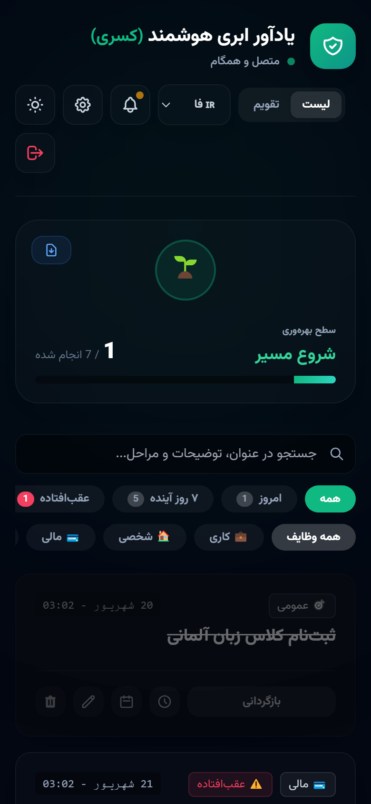

<div dir="rtl">

<div align="center">


# نیروانا: یادآور ابری هوشمند

**یک اپ یادآور چندزبانه (PWA) با تقویم شمسی، ربات تلگرام، اعلان مرورگر و ثبت وظیفه با هوش مصنوعی؛ بدون سرور، روی Vercel و Redis.**

[](https://github.com/masterkasra/vercelreminder/actions/workflows/ci.yml)
[](LICENSE)

[نسخه آنلاین](https://vercelreminder-chi.vercel.app) · [ربات تلگرام](https://t.me/Nirvana_Reminderbot) · [English](README.md)

</div>

<p align="center">
  
</p>

## چرا نیروانا؟

بیشتر اپ‌های یادآور تقویم شمسی را پشتیبانی نمی‌کنند، فقط داخل خود اپ یادآوری می‌کنند و اعلان‌هایشان گاهی بی‌صدا از دست می‌رود. نیروانا فارسی، انگلیسی و آلمانی را پشتیبانی می‌کند. هر یادآور را هم با اعلان مرورگر و هم با پیام تلگرام (با دکمه‌های «انجام شد» و «تعویق») می‌فرستد. وظیفه را می‌شود با تایپ، صدا یا پیام به ربات ثبت کرد.

## امکانات

**یادآورها**
- دسته‌بندی، اولویت، چک‌لیست مراحل، توضیحات و فایل پیوست
- تکرار روزانه، هفتگی و **ماهانه بر اساس تقویم شمسی**؛ هشدار زودهنگام چند روز قبل
- نمای لیست و تقویم (شمسی یا میلادی بر اساس زبان)
- جستجو (با یکسان‌سازی «ي/ی» و «ك/ک») و فیلترهای سریع: امروز، ۷ روز آینده، عقب‌افتاده، انجام‌شده
- تعویق با یک لمس: ۱۰ دقیقه، ۱ ساعت، امشب، فردا صبح
- تایمر پومودورو، افزودن به تقویم گوگل، گزارش PDF
- کار در حالت آفلاین: تغییرات در صف می‌مانند و بعد از وصل شدن به ترتیب همگام می‌شوند

**اعلان‌هایی که واقعاً می‌رسند**
- **اعلان مرورگر (Web Push)** با دکمه‌های «انجام شد» و «تعویق»، حتی وقتی اپ بسته است؛ روی اندروید، دسکتاپ و آیفون (iOS 16.4+ از صفحه اصلی)
- **پیام تلگرام** با دکمه‌های شیشه‌ای و **خلاصه صبحگاهی** روزانه در ساعت و منطقه زمانی کاربر
- عیب‌یابی داخلی: وضعیت اجازه اعلان، ثبت دستگاه، سلامت زمان‌بند و اعلان آزمایشی با نتیجه تفکیک‌شده برای هر دستگاه

**ربات تلگرام**
- ثبت سریع با جمله فارسی: `خرید نان فردا ساعت 18:30`
- دستورهای `/today` و `/list` با دکمه ✅ انجام و 🗑 حذف (قابل بازگردانی تا ۲۴ ساعت)، `/summary` و `/help`

**هوش مصنوعی و صدا**
- جمله‌ای مثل «فردا عصر به مدیرم ایمیل بزنم» را بنویسید یا بگویید؛ عنوان، تاریخ شمسی، ساعت، اولویت و دسته‌بندی خودکار استخراج می‌شود

**امنیت**
- هش رمز عبور با scrypt و نشست‌های ۶۰ روزه که با تغییر رمز همه باطل می‌شوند
- تأیید مالکیت Chat ID با کد ۶ رقمی تلگرام و بازیابی رمز از طریق ربات
- محدودیت تعداد درخواست برای ورود، ثبت‌نام، کد تأیید، هوش مصنوعی و اعلان آزمایشی؛ جلوگیری از XSS
- وب‌هوک امضاشده تلگرام و کلید اختیاری برای cron
- قفل خوش‌بینانه در Redis (`WATCH`/`MULTI`) تا cron، ربات و تب‌های باز تغییرات همدیگر را پاک نکنند

**تجربه کاربری**
- فارسی (راست‌به‌چپ)، انگلیسی و آلمانی · تم تیره و روشن · قابل نصب به‌صورت اپ

## فناوری‌ها

| بخش | فناوری |
| --- | --- |
| فرانت‌اند | JavaScript خالص، Tailwind CSS، Service Worker، Push API، Web Speech API، jalaali-js |
| بک‌اند | Vercel Serverless Functions (Node.js) |
| داده | Redis |
| سرویس‌ها | Telegram Bot API، Web Push (VAPID)، OpenRouter |
| کیفیت | تست‌های خودکار با Redis شبیه‌سازی‌شده، GitHub Actions |

## راه‌اندازی

```bash
git clone https://github.com/masterkasra/vercelreminder.git
cd vercelreminder
npm install
cp .env.example .env.local
npx vercel dev
```

راهنمای کامل انتشار روی Vercel، اتصال ربات تلگرام و زمان‌بند هر دقیقه در [docs/DEPLOYMENT.md](docs/DEPLOYMENT.md) آمده است. معماری در [docs/ARCHITECTURE.md](docs/ARCHITECTURE.md) و فهرست APIها در [docs/API.md](docs/API.md) توضیح داده شده‌اند.

## تست

```bash
npm test
```

تست‌ها روی احراز هویت، یادآورها، cron، ربات تلگرام و Service Worker اجرا می‌شوند و با هر push در GitHub Actions (Node 20 و 22) اجرا می‌شوند.

## مجوز

[MIT](LICENSE) © masterkasra

</div>
