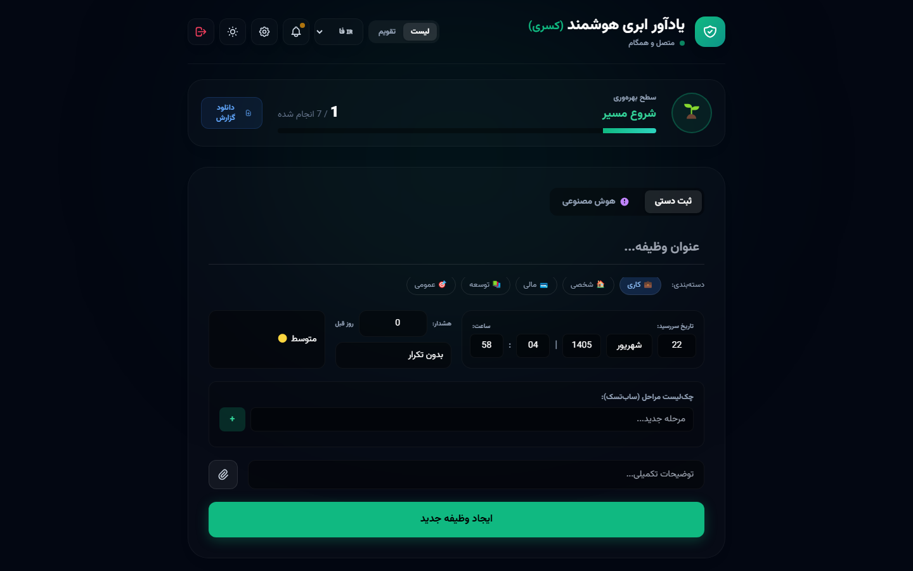
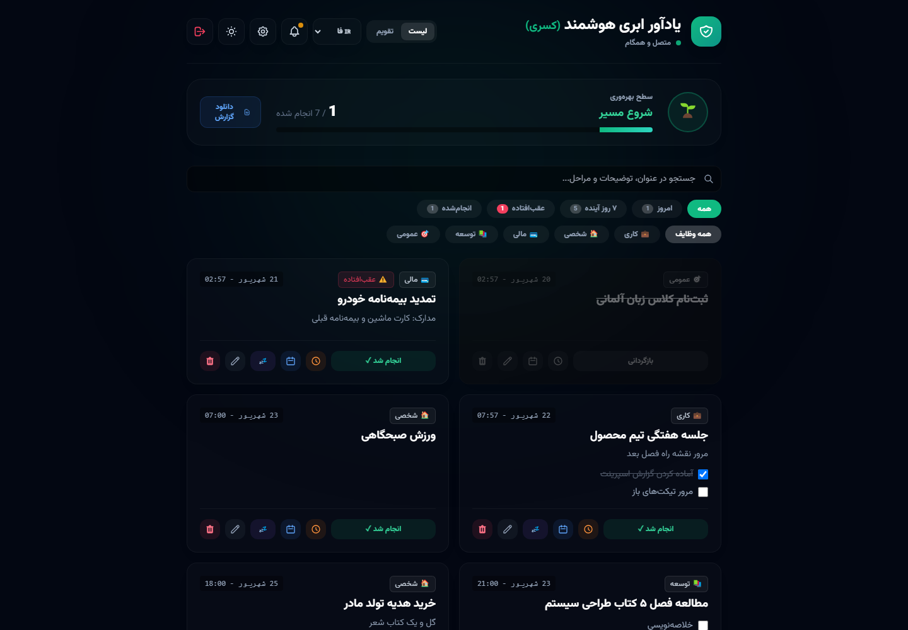
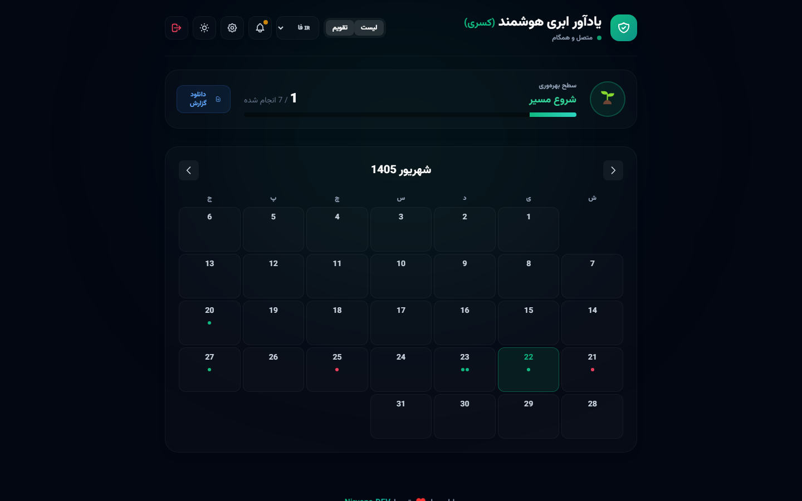
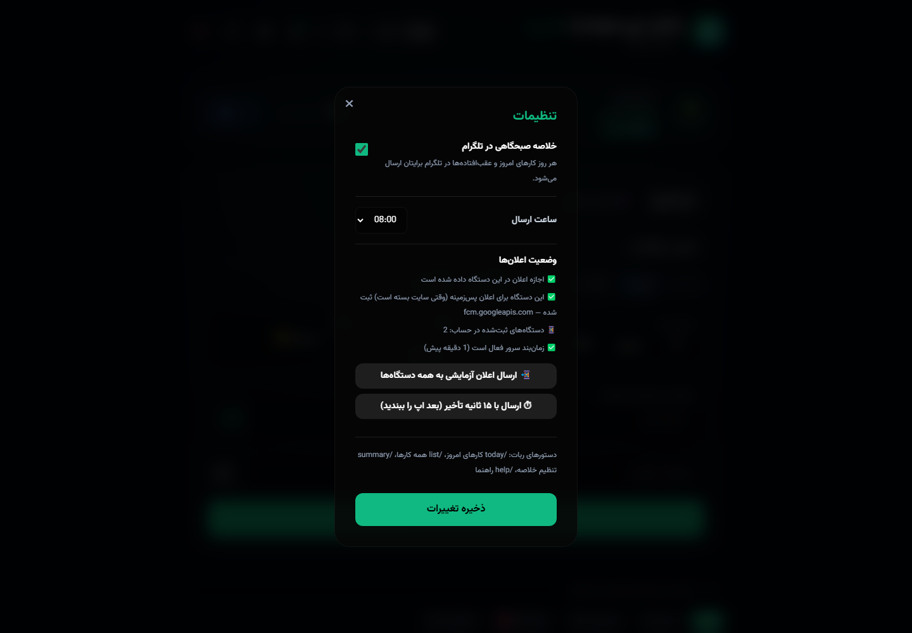
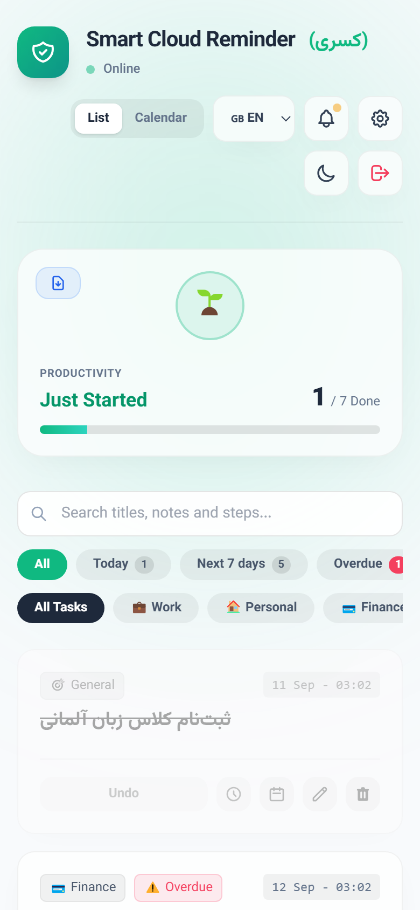
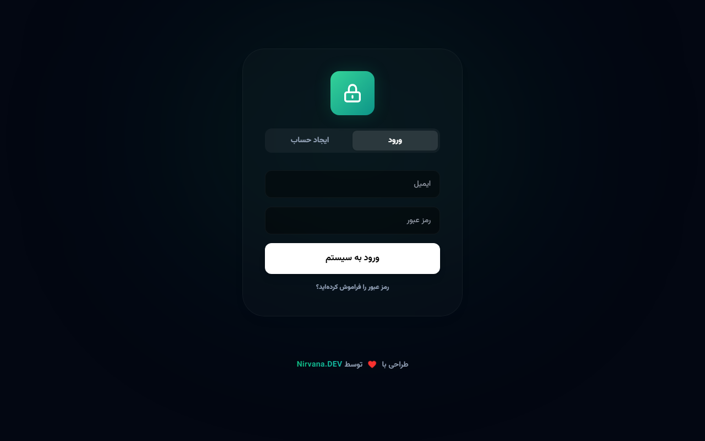
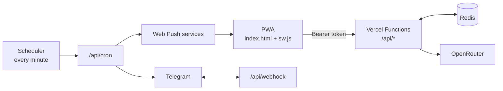

<div align="center">


# Nirvana: Smart Cloud Reminder

**A multilingual reminder PWA with a Jalali calendar, a Telegram bot, Web Push notifications and AI task entry, running serverless on Vercel and Redis.**

[](https://github.com/masterkasra/vercelreminder/actions/workflows/ci.yml)
[](LICENSE)
[](https://vercelreminder-chi.vercel.app)
[](https://t.me/Nirvana_Reminderbot)

[Live app](https://vercelreminder-chi.vercel.app) · [Architecture](docs/ARCHITECTURE.md) · [API](docs/API.md) · [Deployment](docs/DEPLOYMENT.md) · [فارسی](README.fa.md)

</div>

<p align="center">
  
</p>

## Why

Most reminder apps ignore the Persian (Jalali) calendar, don't reach people where they already are, and quietly miss notifications. Nirvana was built to fix all three: it speaks Persian, English and German, delivers every reminder both as a Web Push notification and a Telegram message with action buttons, and lets you add tasks by typing, speaking, or messaging a bot.

## Features

**Reminders**
- Categories, priorities, checklists, notes and file attachments
- Daily, weekly and **Jalali-monthly** recurrence, plus early alerts days in advance
- List and calendar views, in the Jalali or Gregorian calendar depending on the language
- Search that handles Persian/Arabic letter variants, and quick filters: *today*, *next 7 days*, *overdue*, *done*
- One-tap snooze: 10 minutes, 1 hour, tonight, tomorrow morning
- Pomodoro focus timer, Google Calendar export, PDF progress report
- Offline-first: changes are queued locally and synced in order, with visible feedback when the server rejects one

**Notifications that actually arrive**
- **Web Push** with *done* / *snooze* buttons while the app is closed, on Android, desktop and iOS 16.4+ home-screen apps
- **Telegram** messages with inline buttons, and a daily **morning summary** at the user's chosen hour and timezone
- Built-in diagnostics: permission state, device registration, scheduler health, and a test push with a per-device result

**Telegram bot**
- Quick add in plain Persian: `خرید نان فردا ساعت 18:30`
- `/today` and `/list` with ✅ done and 🗑 delete buttons (delete can be undone for 24 hours), `/summary`, `/help`

**AI and voice**
- Type or say a sentence such as *"email my manager tomorrow evening"*; an LLM extracts the title, date, time, priority and category, with Jalali dates for Persian

**Security**
- scrypt password hashing and 60-day bearer sessions, all revoked on password reset
- Telegram-verified chat ownership (6-digit code) and password recovery through the bot
- Rate limits on login, sign-up, verification codes, AI and test pushes; HTML escaping against XSS
- Signed Telegram webhook (`secret_token`) and an optional cron secret
- Optimistic concurrency with Redis `WATCH`/`MULTI`, so the cron, the bot and open tabs never overwrite each other

**Experience**
- Persian (RTL), English and German · dark and light themes · installable PWA with an offline shell

## Screenshots

| Task list | Calendar | Notification settings |
| --- | --- | --- |
|  |  |  |

| Mobile (Persian) | Mobile (English, light) | Sign in |
| --- | --- | --- |
|  |  |  |

## Tech stack

| Layer | Technology |
| --- | --- |
| Frontend | Vanilla JavaScript, Tailwind CSS (precompiled), Service Worker, Push API, Web Speech API, jalaali-js |
| Backend | Vercel Serverless Functions (Node.js, ES modules) |
| Data | Redis (node-redis v4) with optimistic locking |
| Integrations | Telegram Bot API, Web Push (VAPID), OpenRouter LLM |
| Quality | Node test suites with an in-memory Redis mock, GitHub Actions CI |

## Architecture



Design decisions, the Redis data model and the delivery flow are documented in [docs/ARCHITECTURE.md](docs/ARCHITECTURE.md). Every endpoint is described in [docs/API.md](docs/API.md).

## Getting started

```bash
git clone https://github.com/masterkasra/vercelreminder.git
cd vercelreminder
npm install
cp .env.example .env.local   # REDIS_URL, TELEGRAM_BOT_TOKEN, ...
npx vercel dev
```

To run it in production: deploy to Vercel, connect Redis, point the Telegram webhook at `/api/webhook`, and call `/api/cron` every minute from a scheduler. The step-by-step guide is in [docs/DEPLOYMENT.md](docs/DEPLOYMENT.md).

## Tests

```bash
npm test
```

The suites run the real API handlers against an in-memory Redis mock, with Telegram and Web Push stubbed, so they need no network or services. They cover:

- Authentication: registration, Telegram verification, legacy password migration, account takeover attempts, brute-force limits, password reset
- Reminders: validation, attachments, concurrent writes
- Cron: Jalali monthly recurrence, retries, expired push subscriptions, push timeouts, the morning summary
- Telegram bot: commands, buttons, snooze presets across timezones, undo
- Service worker: push, notification actions

CI runs them on Node 20 and 22 for every push.

## Roadmap

- [ ] Shared lists and assigning tasks to other people
- [ ] Flexible recurrence: every N days, specific weekdays, end date
- [ ] Create and reschedule tasks directly in the calendar
- [ ] Quiet hours for notifications
- [ ] Import and export (JSON, CSV)
- [ ] Active session management ("sign out of all devices")
- [ ] Two-way Google Calendar sync

## License

[MIT](LICENSE) © masterkasra
