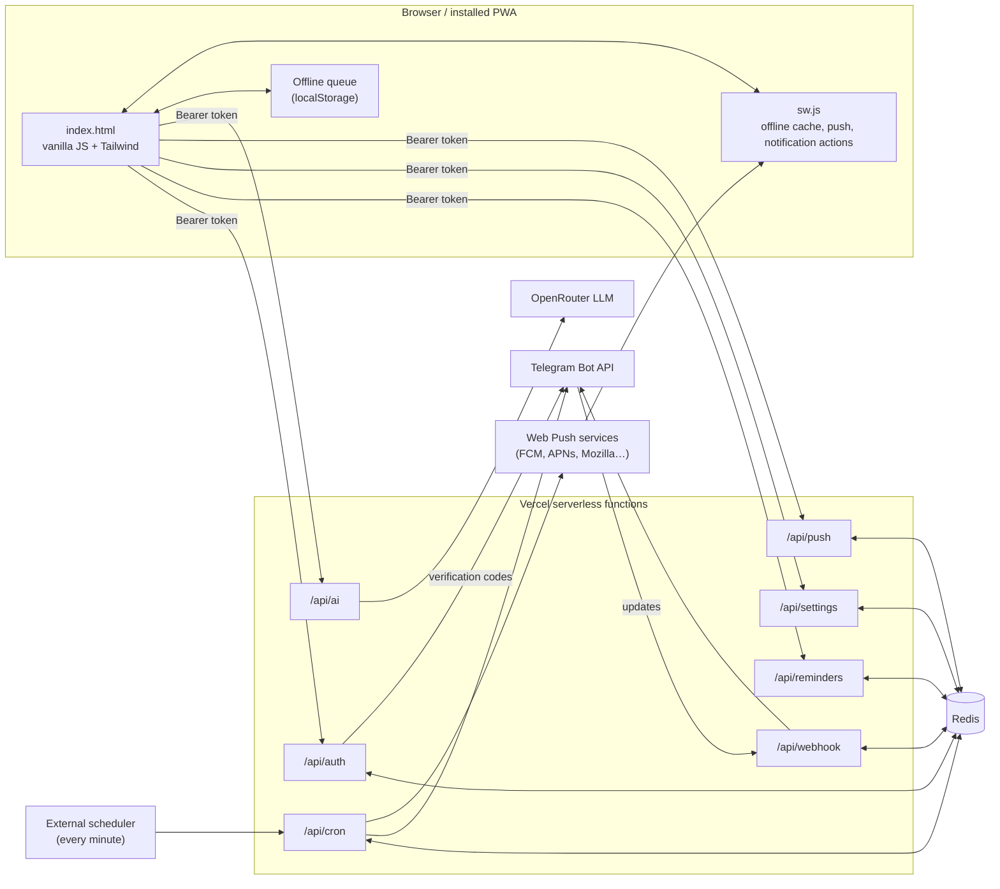
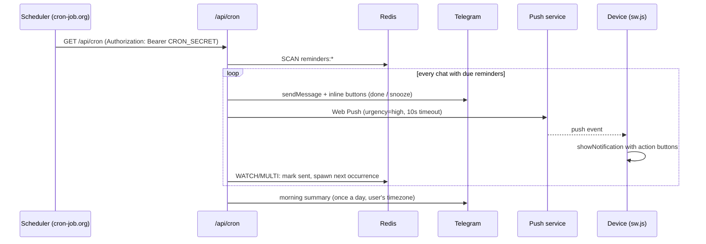

# Architecture

Nirvana is a single-page PWA served as static files, backed by a handful of Vercel serverless functions and one Redis database. There is no build step for the app itself; Tailwind is precompiled into `styles.css`.

## Overview



## How a reminder is delivered



## Design decisions

| Decision | Why |
| --- | --- |
| **Vanilla JS single page** | Zero build tooling for the app; loads fast and is easy to host anywhere. |
| **Redis with `WATCH`/`MULTI`** (`lib/db.js` → `updateJSON`) | The cron, the Telegram webhook and several open tabs can write the same reminder list at once. Optimistic locking retries instead of silently losing updates. Falls back to plain get/set on providers without `WATCH`. |
| **Session tokens + scrypt** | Passwords are hashed with Node's built-in `scrypt`; API calls use a random 256-bit bearer token (60-day TTL). All sessions are revoked when the password is reset. |
| **Chat ID ownership via Telegram code** | Reminders are keyed by Telegram chat ID. A 6-digit code sent by the bot proves the user owns that chat, so nobody can register with someone else's ID. |
| **Attachments in separate keys** | Files (≤ 1 MB) live under `attachment:{chatId}:{id}` and are downloaded on demand, so listing reminders stays small. |
| **Offline queue** | Every change is applied locally first and synced in order; 5xx/network errors are retried, rejected changes are surfaced with a toast. |
| **Timezone-aware server** | Vercel runs in UTC. The browser reports its `getTimezoneOffset()`; Telegram quick-add, snooze presets and the morning summary use it (default Tehran, UTC+3:30). |
| **Jalali monthly recurrence** | "Monthly" moves to the same day of the next Jalali month (clamped to month length) instead of adding 30 days. |
| **Web Push hardening** | VAPID keys are generated once and stored in Redis; each push has a 10 s timeout and `urgency: high`; subscriptions that fail 5 times in a row are dropped. |
| **Precompiled Tailwind** | `npm run build:css` replaces the Tailwind Play CDN, which is not meant for production. |

## Data model (Redis keys)

| Key | Value |
| --- | --- |
| `user:{email}` | Profile, `passwordHash`, `chatId`, `chatVerified` |
| `session:{token}` | `{ email, chatId }`, expires after 60 days |
| `usersessions:{email}` | Active session tokens (max 20), used for revocation |
| `verify:{email}` | Hashed 6-digit code, attempts, pending registration (10 min TTL) |
| `chatowner:{chatId}` | Email of the account that verified this Telegram chat |
| `reminders:{chatId}` | JSON array of reminders |
| `attachment:{chatId}:{id}` | `{ name, type, data }` (data URL) |
| `trash:{chatId}:{id}` | Reminder deleted from Telegram, restorable for 24 h |
| `push:{chatId}` | Web Push subscriptions with failure counters |
| `settings:{chatId}` | `dailySummary`, `summaryHour`, `tzOffsetMinutes`, `lastSummaryDate` |
| `ratelimit:*` | Counters for login, registration, codes, AI and test pushes |
| `config:*` | VAPID keys, webhook/commands setup flags, last cron run |

## Project structure

```
├── index.html            # The whole client app (UI, i18n, offline queue, notifications)
├── sw.js                 # Service worker: cache, push events, notification actions
├── styles.css            # Precompiled Tailwind (npm run build:css)
├── manifest.json, icons/ # PWA metadata and icons
├── api/                  # Vercel serverless functions (one file per endpoint)
│   ├── auth.js           # register, verify, login, forgot/reset password, logout
│   ├── reminders.js      # CRUD, complete, snooze, attachments
│   ├── settings.js       # morning summary + timezone, notification diagnostics
│   ├── push.js           # Web Push subscribe/unsubscribe/test
│   ├── ai.js             # natural-language → reminder (OpenRouter)
│   ├── cron.js           # due reminders, recurrence, morning summary
│   └── webhook.js        # Telegram bot: commands, buttons, quick add
├── lib/
│   ├── db.js             # Redis client, optimistic updates, sessions, hashing, rate limits
│   ├── push.js           # VAPID keys, sending with timeouts, subscription cleanup
│   ├── telegram.js       # Bot API helper, webhook secret
│   ├── bot.js            # Telegram texts, keyboards, task lists, snooze math (Jalali dates)
│   └── settings.js       # Per-chat settings
└── tests/                # Node test suites with an in-memory Redis mock
```
